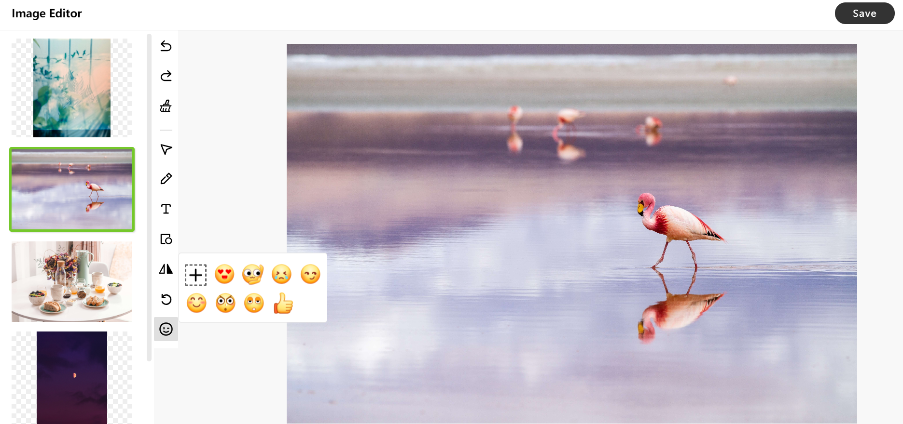

## 🔧 Development

This repo is forked from TOAST UI.
I add some feature and rewrite it ui.


### Setup

Fork `master` branch into your personal repository.
Clone to local computer. 
Install node modules.
Before starting development, check for any errors.

```sh
$ npm install
$ npm run serve
```

## 📙 Documents
* **Tutorial** : [https://github.com/nhn/tui.image-editor/tree/master/docs](https://github.com/nhn/tui.image-editor/tree/master/docs)
* **Example** : [http://nhn.github.io/tui.image-editor/latest/tutorial-example01-includeUi](http://nhn.github.io/tui.image-editor/latest/tutorial-example01-includeUi)
* **API** : [http://nhn.github.io/tui.image-editor/latest](http://nhn.github.io/tui.image-editor/latest/index)


## 🔩 Dependency
* [fabric.js](https://github.com/fabricjs/fabric.js/releases) >=3.0.0 && <= 3.3.2
* [tui.code-snippet](https://github.com/nhn/tui.code-snippet/releases/tag/v1.3.0) >=1.3.0
* [tui.color-picker](https://github.com/nhn/tui.color-picker/releases/tag/v2.2.0) >=2.2.0


